# CA Manager — User Manual

CA Manager is a web-based PKI management tool for issuing, tracking, and revoking X.509 certificates. It manages certificate authorities (CAs), leaf certificates, CSRs, and CRLs, with role-based access control, audit logging, and optional LDAP authentication.

---

## Table of Contents

1. [Getting Started](#1-getting-started)
2. [Dashboard](#2-dashboard)
3. [Certificate Authorities](#3-certificate-authorities)
4. [Certificates](#4-certificates)
5. [Bulk JKS Import](#5-bulk-jks-import)
6. [CSR Inbox](#6-csr-inbox)
7. [Certificate Revocation List (CRL)](#7-certificate-revocation-list-crl)
8. [Policies](#8-policies)
9. [Configuration](#9-configuration)
   - [9.1 Database](#91-database)
   - [9.2 LDAP](#92-ldap)
   - [9.3 Security](#93-security)
   - [9.4 Email & Reports](#94-email--reports)
   - [9.5 Key Encryption](#95-key-encryption)
   - [9.6 DN Defaults](#96-dn-defaults)
   - [9.7 CRL Refresh](#97-crl-refresh)
   - [9.8 HTTPS / TLS](#98-https--tls)
   - [9.9 Maintenance](#99-maintenance)
10. [Access Control](#10-access-control)
   - [10.1 Users](#101-users)
   - [10.2 Roles](#102-roles)
   - [10.3 Permissions Reference](#103-permissions-reference)
   - [10.4 Teams](#104-teams)
11. [Automation API Access](#11-automation-api-access)
12. [ACME Enrollment](#12-acme-enrollment)
13. [SCEP Enrollment](#13-scep-enrollment)
14. [Audit Log](#14-audit-log)
15. [TLS Probe](#15-tls-probe)
16. [In-App Documentation](#16-in-app-documentation)
17. [Deployment Process](#17-deployment-process)
18. [Appendix A — Environment Variables](#appendix-a--environment-variables)
19. [Appendix B — Running with Docker](#appendix-b--running-with-docker)

---

## 1. Getting Started

### First Launch — Bootstrap Admin

When CA Manager starts with an empty database it requires an initial administrator account before anything else can be done.

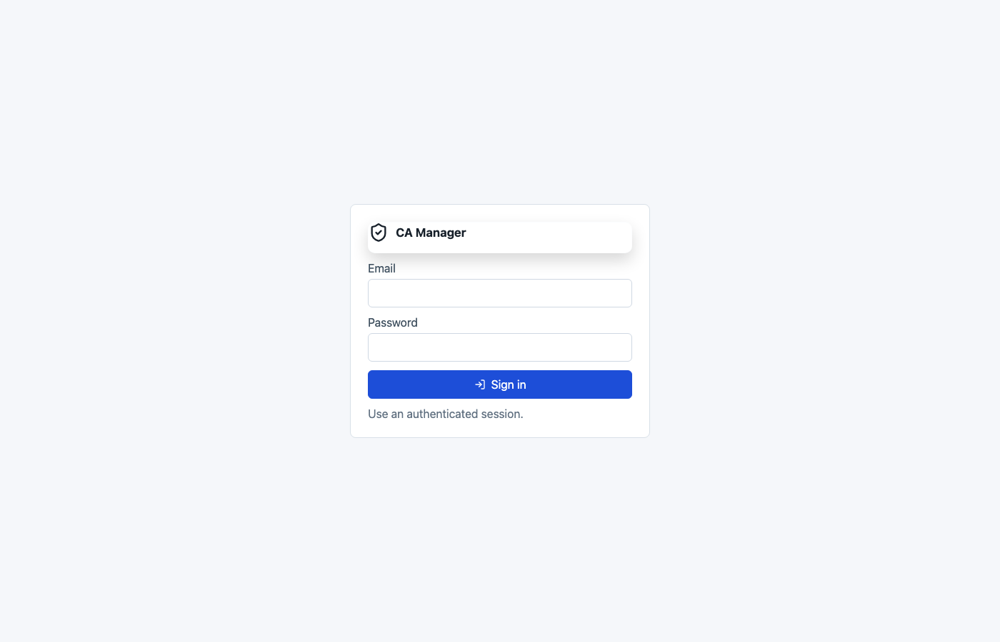

On the bootstrap form enter an email address, an optional display name, and a password of at least 12 characters, then click **Create Admin Account**. You are logged in immediately and taken to the Dashboard.

> This step happens once. After the internal admin account exists, the normal sign-in screen is shown for all future visits.

### Signing In

Enter your email and password and click **Sign In**. CA Manager supports two authentication modes:

- **Internal** — credentials stored in the CA Manager database.
- **LDAP** — federated login via a configured LDAP / Active Directory server (see [LDAP](#92-ldap)).

### Signing Out

Click **Sign Out** in the bottom-left of the sidebar.

---

## 2. Dashboard

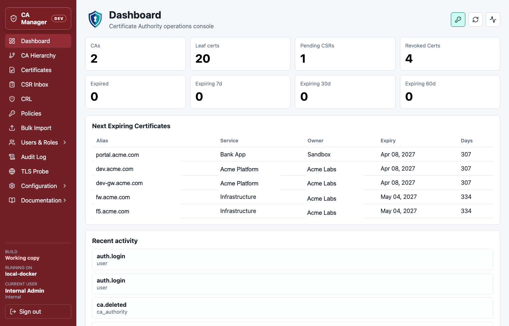

The Dashboard shows a summary of your PKI inventory:

- **Certificate Authorities** — total root and intermediate CAs.
- **Certificates** — total issued, with quick counts for revoked, expiring soon, and already expired certificates.
- **Pending CSRs** — requests waiting to be signed.
- **Recent Activity** — the last several audit events.

Click any summary card to navigate to the corresponding section. The **Revoked Certs** card opens the Certificates list with the status filter set to **Revoked**.

---

## 3. Certificate Authorities

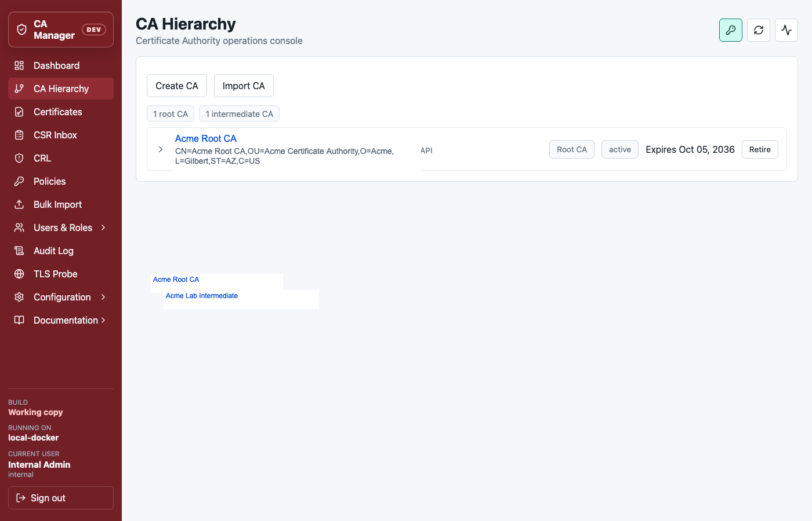

The **CA Hierarchy** tab lists all certificate authorities in the system.

### 3.1 CA List Columns

| Column | Description |
|---|---|
| **Name** | The common name (CN) from the CA subject. Clicking it opens the CA details panel. |
| **Type** | Root or Intermediate. |
| **Issuer** | Parent CA for intermediates; "root" for root CAs. |
| **Status** | Active or Retired. |
| **Expires** | Certificate expiry date. |

### 3.2 Creating a Root CA

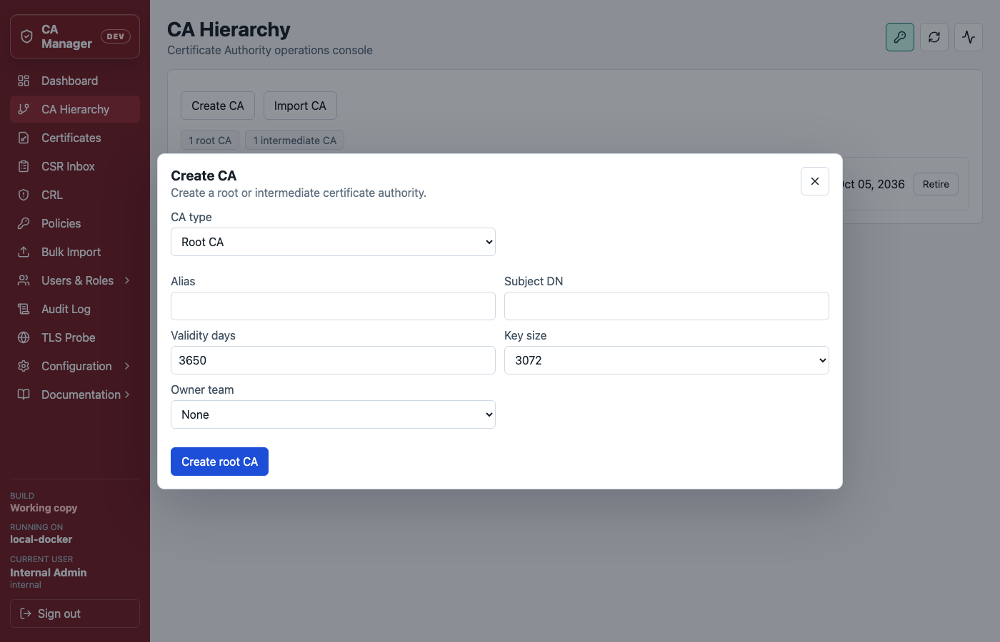

1. Click **Create CA**.
2. Enter an **Alias** for inventory display and complete the **Subject DN** fields.
3. Choose a **Key Size** (2048, 3072, or 4096 bits) and **Validity Days**.
4. Optionally assign an **Owner** team, environment, service name, and contact email.
5. Click **Create Root CA**.

The certificate and private key are generated immediately and stored encrypted in the database.

### 3.3 Creating an Intermediate CA

1. Click **Create CA**, then switch to the **Intermediate** tab.
2. Select an active root **Issuing CA**. Intermediate CAs cannot issue other intermediate CAs.
3. Enter an **Alias** and complete the **Subject DN** and validity fields.
4. Click **Create Intermediate CA**.

### 3.4 Importing a CA

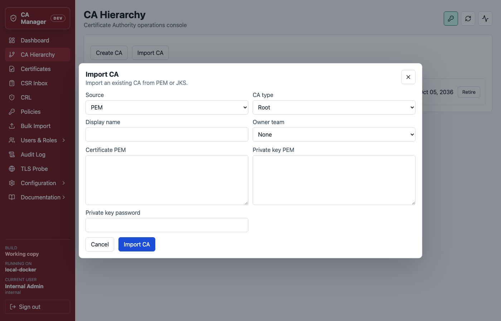

To import an existing CA certificate and private key:

1. Click **Import CA**.
2. Choose the source format: **PEM** or **JKS** (Java KeyStore).
3. **PEM**: paste the certificate PEM and private key PEM (with optional key password).  
   **JKS**: choose the `.jks` file, enter the store password, key password, and alias.
4. Set the **CA type** (Root or Intermediate) and, for intermediates, select an active root **Issuer CA**.
5. Click **Import CA**.

### 3.5 CA Details

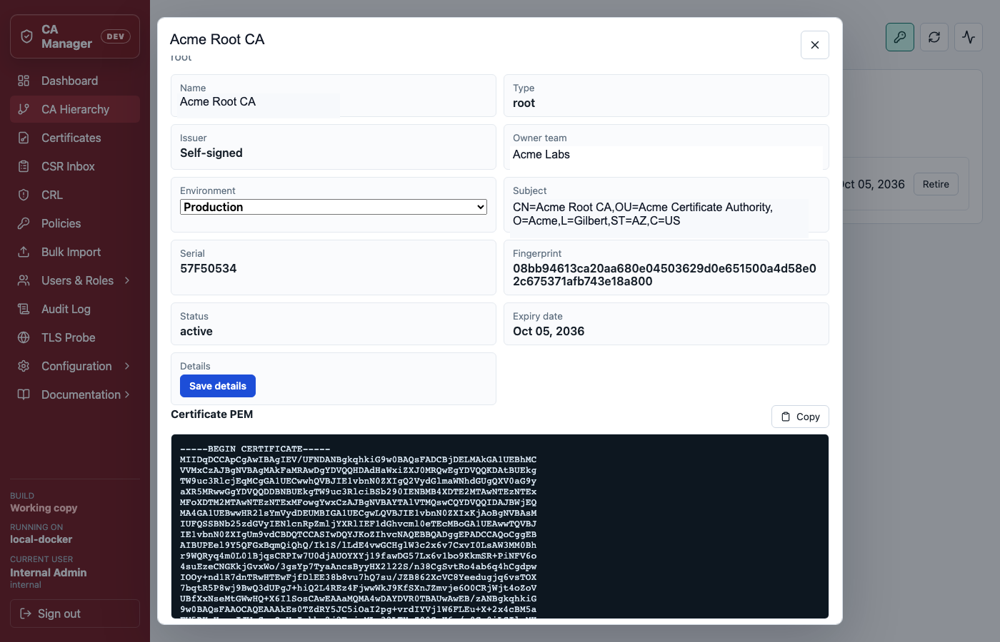

Click a CA's name to open its details panel. From here you can:

- View the certificate PEM and full chain PEM (leaf → intermediates → root).
- View the public CRL distribution endpoint URL for this CA.
- Edit ownership metadata (team, environment, service name, contact email).
- **Retire** the CA — marks it inactive and prevents it from signing new certificates. Existing child CAs and issued certificates are not affected.

### 3.6 Permanently Deleting a Retired CA

Once a CA is retired, a **Delete** button becomes available when it has no active child CA certificates or active leaf certificates. Clicking **Delete** permanently removes the CA and all associated data (keys, chain records). This cannot be undone.

> Only retired CAs with no active child certificates can be deleted. An active CA must be retired first.

---

## 4. Certificates

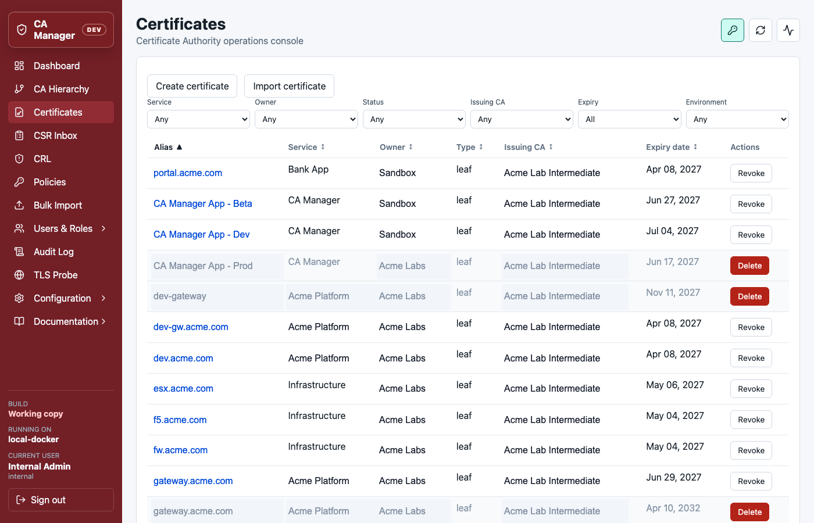

The **Certificates** tab lists all leaf certificates tracked by CA Manager.

The list shows 15 certificates per page and defaults to alias ascending. Click sortable column headers, such as **Alias**, **Service**, **Owner**, **Type**, **Issuing CA**, or **Expiry date**, to change the server-side sort order.

### 4.1 Filters

| Filter | Description |
|---|---|
| **Expiry** | All, Expired, expiring within 7 / 30 / 60 days. |
| **Status** | Any, Active, Revoked. |
| **Issuing CA** | Filter by the signing CA. |
| **Owner** | Filter by owning team. |
| **Service** | Dropdown of known service names; filters to certificates matching that service. |
| **Environment** | Production, Staging, Unit Test, Development, Lab. |

### 4.2 Creating a Certificate

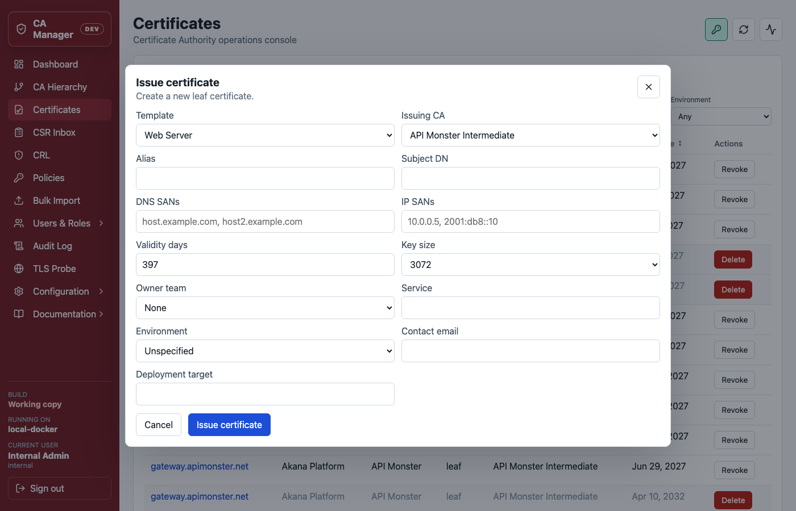

1. Click **Create certificate**.
2. Optionally select a **Certificate Template** to pre-fill key usage, extended key usage, validity, and SAN mode. Built-in templates include:
   - **Web Server** — TLS server auth, DNS or IP SAN required, 397 days.
   - **VPN Client** — client auth, 397 days.
   - **mTLS Client** — mutual TLS client auth, URI SAN optional, 397 days.
   - **Email Signing** — S/MIME, email SAN required, 397 days.
   - **Code Signing** — code signing, no SAN required, 825 days.
3. Select an active intermediate **Issuing CA**. Root CAs cannot issue leaf certificates.
4. Enter the **Common Name** and optionally extra **DNS SANs** or **IP SANs** (comma-separated). If the Common Name is an IP address, CA Manager adds it as an IP SAN.
5. Set **Validity Days** and **Key Size** (overrides template defaults if changed).
6. Optionally fill in ownership metadata (team, service name, environment, contact email, deployment target).
7. Click **Issue Certificate**.

### 4.3 Importing a Certificate

To import an existing certificate:

1. Click **Import certificate**.
2. Choose **PEM**, **PKCS#12 / PFX**, or **JKS** as the source.
3. Provide the certificate and private key (PEM), upload a `.p12` or `.pfx` bundle with its optional password, or supply JKS credentials.
4. Fill in ownership metadata as desired.
5. Click **Import**.

### 4.4 Certificate Details

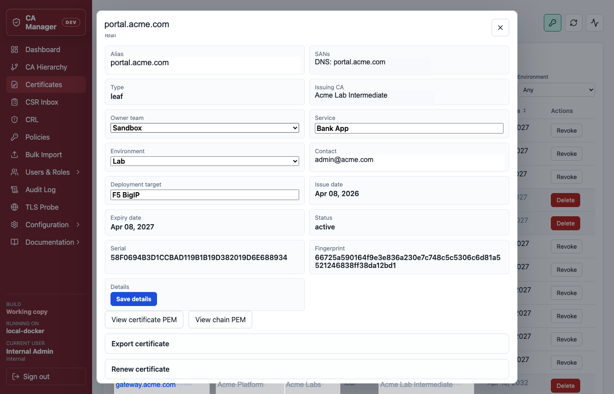

Click a certificate's common name to open its details panel:

- **Subject DN**, serial number, SHA-256 fingerprint, and validity dates.
- **DNS SANs** — dropdown listing all Subject Alternative Names on the certificate.
- **Alias** — editable inventory display name. Changing it does not rewrite the X.509 subject or SANs.
- **Deployment Target** — editable field for tracking where the certificate is deployed (e.g., a server hostname or load balancer).
- **Ownership metadata** — team, service name, environment, and contact email (all editable). Click **Save Details** to persist changes.
- **View Certificate PEM** / **View Chain PEM** — expanders that show the certificate PEM and the full chain from leaf to root.
- **Export** — opens the export panel with the following format options:
  - **PEM** — downloads the certificate PEM and chain. Check **Include Private Key** to also export the private key (requires `leaf:export_private_key`).
  - **PKCS#12 / PFX** — downloads a password-protected bundle with the certificate, chain, and private key (requires `leaf:export_private_key`).
  - **JKS** — downloads a Java KeyStore with the certificate, chain, and private key (requires `leaf:export_private_key`).
- **Renew** — issues a replacement certificate with the same or updated parameters. Renewal requires the original issuing CA to be an active intermediate.

### 4.5 Revoking a Certificate

1. Click **Revoke** in the certificate row.
2. Confirm the action.

Revoked certificates stay in the inventory, are displayed with a grey row, and are included in the next CRL generated for their issuing CA.

### 4.6 Deleting a Revoked Certificate

After a certificate is revoked, the **Revoke** button becomes **Delete**. Clicking **Delete** permanently removes the certificate and all its history. This cannot be undone.

> Only revoked certificates can be deleted. Active certificates must be revoked first.

### 4.7 Renewing a Certificate

1. Open the certificate's details panel.
2. Click **Renew Certificate**.
3. Adjust validity days, key size, DNS SANs, or IP SANs if needed.
4. Optionally check **Revoke old certificate** to automatically revoke the current one after the new certificate is issued.
5. Click **Renew**.

### 4.8 Batch Renewal

Batch renewal is available through the API for automation workflows that need to renew multiple leaf certificates in one request.

| Endpoint | Purpose |
|---|---|
| `POST /api/v1/certificates/batch-renew` | Renew multiple certificate IDs and return per-certificate results. |

The request can include `validityDays`, `keySize`, and `revokeOld`. Each certificate result reports whether renewal succeeded or failed.

---

## 5. Bulk JKS Import

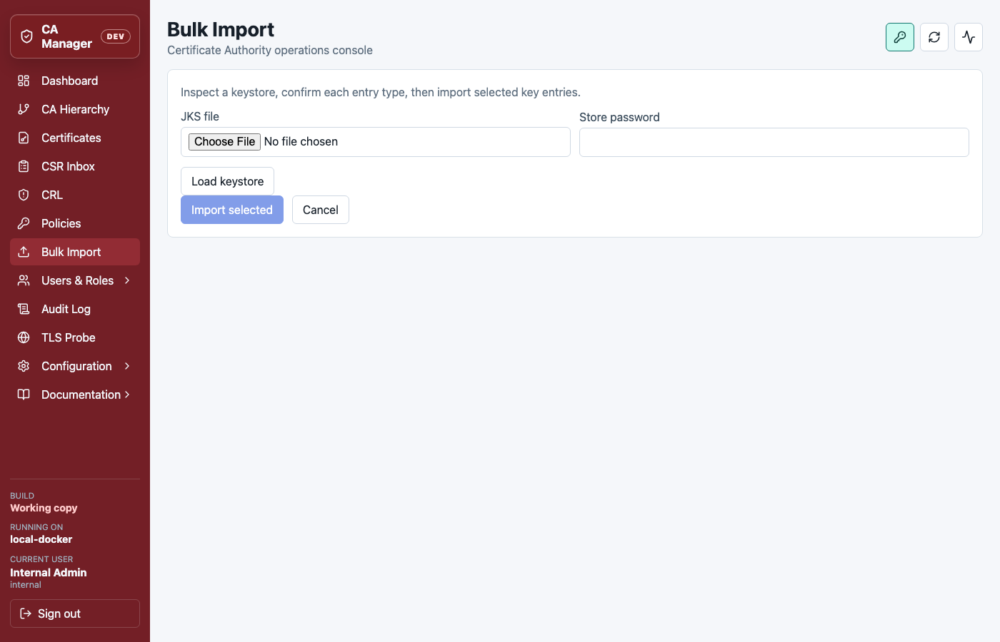

The **Bulk Import** tab imports multiple certificates from a single Java KeyStore file.

### Steps

1. Click **Choose File** and select your `.jks` file.
2. Enter the **Store Password** and click **Load Entries**. All aliases in the keystore are listed.
3. For each entry, supply the **Key Password** (may differ from the store password) and select the **Issuing CA**.
4. Use the **Owner** dropdown in the table header to assign the same team to all entries at once, or set owners per row.
5. Use the **Select All** checkbox in the header to select or deselect all entries.
6. Click **Import Selected**.

A success banner confirms how many certificates were imported. Entries with incorrect key passwords show a per-row error rather than silently failing.

---

## 6. CSR Inbox

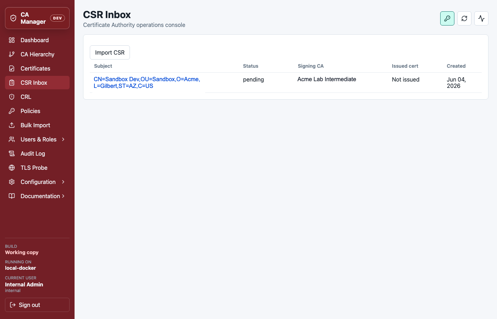

The **CSR Inbox** shows Certificate Signing Requests submitted via the API or external tools (e.g., `openssl req`).

Click **Import CSR** to paste a PEM-encoded CSR or load a `.csr`/`.pem` text file. You can optionally preselect the intermediate CA that will sign it.

### Reviewing a CSR

Click **Review** to open the CSR detail view:

- Inspect the **Subject DN**, **SANs**, and **Public Key** before signing.
- Choose a common rejection reason, or choose **Other** and enter a short reason, then click **Reject CSR** to reject the request. Rejected CSRs remain in the inbox and cannot be signed.
- Select an active intermediate **Issuing CA** and set the **Validity Days**. Root CAs cannot sign leaf CSRs.
- Optionally override DNS or IP SANs before signing.
- Click **Sign CSR** to generate the certificate. The CSR remains in the inbox as `signed` and links to the issued certificate.

---

## 7. Certificate Revocation List (CRL)

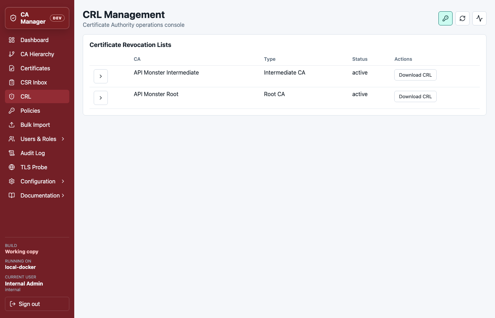

The **CRL** tab lists every CA and its revocation status. Each row is expandable — click a CA name to reveal the certificates revoked under it.

### Revoked Certificate Columns

| Column | Description |
|---|---|
| **Common Name** | Subject CN of the revoked certificate. |
| **Serial Number** | Certificate serial number in hex. |
| **Revoked At** | Timestamp of revocation. |

### Downloading a CRL

Click **Download CRL** on any CA row to download the current CRL in PEM format. This file can be published to an HTTP distribution point or imported into a trust store.

### Public Revocation Endpoints

CA Manager also serves revocation data directly at unauthenticated HTTP endpoints. These URLs are suitable for use as CRL Distribution Points (CDP), OCSP AIA locations, and client revocation checking:

| Endpoint | Format |
|---|---|
| `GET /crl/{caId}` | DER (`application/pkix-crl`) |
| `GET /crl/{caId}.pem` | PEM (`application/x-pem-file`) |
| `POST /ocsp/{caId}` | DER OCSP response (`application/ocsp-response`) |

The CA details panel displays the CRL distribution URL for each CA. Revocation endpoints can be baked into issued certificates via policy `crlDistributionUrls` and `ocspUrls`.

---

## 8. Policies

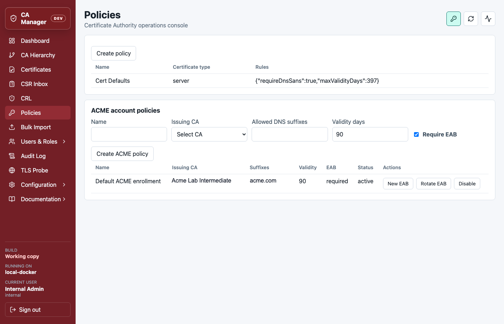

Policies are reusable signing profiles. A policy specifies:

- **Key usages** and **extended key usages** (e.g., TLS Server Authentication, Code Signing).
- **Maximum validity** in days.
- **Allowed SANs** patterns.
- **Allowed subject DN** components.
- **CRL Distribution URLs** — one or more URLs embedded as a `cRLDistributionPoints` extension in every certificate issued under this policy. Use the `{caId}` placeholder for the signing CA's public CRL endpoint (e.g., `http://camanager.example.com/crl/{caId}`).
- **OCSP URLs** — one or more URLs embedded as an Authority Information Access OCSP location. Use the `{caId}` placeholder for the signing CA's public OCSP endpoint (e.g., `http://camanager.example.com/ocsp/{caId}`).

When issuing a certificate, selecting a policy pre-fills the form and enforces its constraints. Policies are optional — certificates can be issued without one.

### 8.1 ACME Account Policies

The **Policies** tab also includes ACME account policy management for internal ACME enrollment.

An ACME account policy defines:

- The issuing intermediate CA.
- Allowed DNS suffixes for ACME identifiers.
- Maximum validity days.
- Whether External Account Binding (EAB) is required.
- Whether the policy is active or disabled.

To create an ACME account policy:

1. Open **Policies**.
2. In **ACME account policies**, enter a policy name.
3. Select an active intermediate CA.
4. Enter allowed DNS suffixes, comma-separated.
5. Set the validity limit and choose whether EAB is required.
6. Click **Create ACME policy**.

Each ACME policy row includes actions to create a new EAB key, rotate the active EAB key, or enable/disable the policy.

> EAB HMAC secrets are shown only when created or rotated. Store them securely before leaving the message.

---

## 9. Configuration

The **Configuration** section is in the left navigation bar and contains several sub-sections.

### 9.1 Database

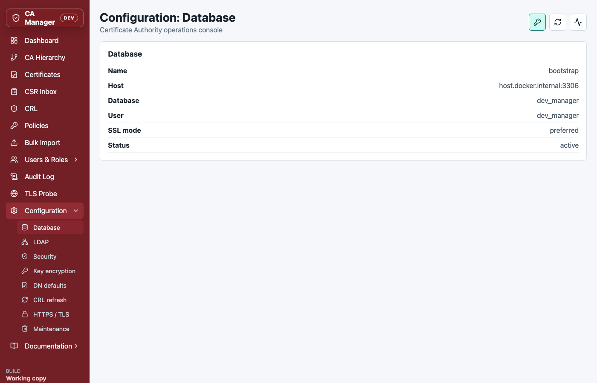

Shows the current database connection settings (host, port, database name). These values are read-only in the UI and must be changed via environment variables.

### 9.2 LDAP

Configure LDAP / Active Directory for federated authentication.

| Field | Description |
|---|---|
| **Directory Type** | Select OpenLDAP or Active Directory. Active Directory uses AD-specific user and group lookup attributes. |
| **URL** | `ldap://` or `ldaps://` server URL. |
| **TLS Mode** | None, StartTLS, or LDAPS. |
| **Bind DN** | Service account DN or UPN used to search the directory. |
| **Bind Password** | Password for the service account. |
| **User Search Base** | Base DN under which users are searched. |
| **User Filter** | LDAP filter to locate a user record by username. |

Click **Test Connection** to verify settings before saving.

#### LDAP Group → Role Mappings

Map LDAP groups to CA Manager roles for administrative assignment and validation. Scheduled group synchronization and automatic nested Active Directory group expansion are not currently enabled, so imported LDAP users should still be reviewed from **Users & Roles** after they are added.

### 9.3 Security

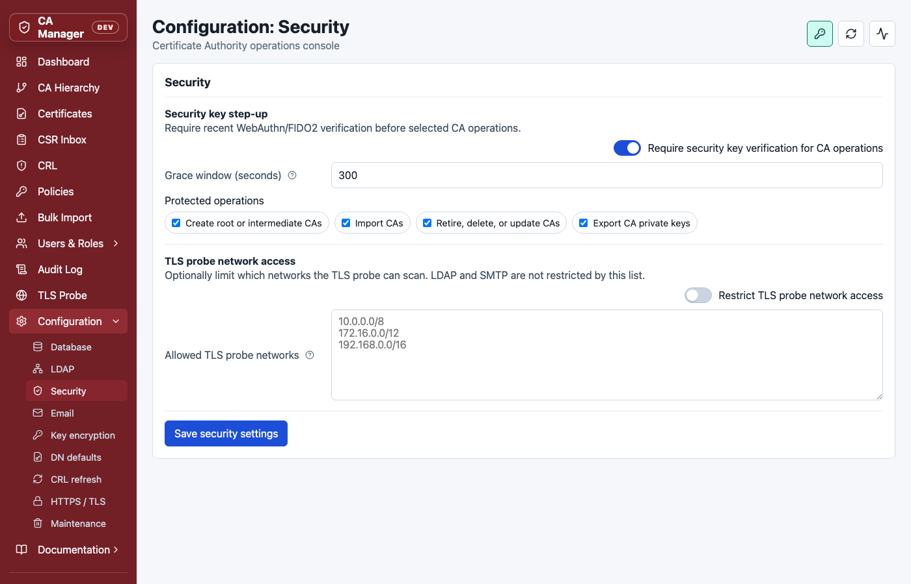

Use **Configuration > Security** to require WebAuthn/FIDO2 security-key verification before selected CA operations. When enabled, users keep their normal session and RBAC permissions, but protected CA actions also require a recent security-key verification.

Available settings:

- **Require security key verification for CA operations** — enables or disables step-up enforcement.
- **Grace window (seconds)** — controls how many seconds a successful security-key verification can be reused.
- **Protected operations** — selects which CA action groups require step-up, including CA creation, CA import, CA update/retire/delete, and CA private-key export.
- **Restrict TLS probe network access** — enables or disables the TLS probe network allow-list.
- **Allowed TLS probe networks** — optionally restricts TLS probe scans to exact IPs or CIDR ranges when restriction is enabled. Leave the list blank to allow all lab networks. LDAP and SMTP connections are not restricted by this list.

When a protected CA operation needs verification, the browser prompts for the current user's enrolled security key and retries the operation after successful verification.

### 9.4 Email & Reports

The **Email** configuration panel defines the SMTP server used for test email, certificate expiry alerts, and monthly team reports.

Users with `config:manage` can set:

- SMTP host, port, and security mode (`STARTTLS`, `TLS`, or `None`).
- Optional SMTP username and password.
- From address, display name, reply-to address, and active/disabled status.

Click **Send test** to verify delivery to a single recipient. The password field can be left blank when editing an existing SMTP configuration; CA Manager keeps the stored encrypted password.

Click **Run due reports** to manually run scheduled report checks. The recent delivery table shows report type, team, subject, delivery status, and recipient count.

Team-level report settings are managed under **Users & Roles → Teams**. Each team can:

- Send reports to active team members.
- Add a team distribution email.
- Add extra comma-separated recipients.
- Enable or disable expiry alerts.
- Set the expiry alert threshold in days. The default is 30 days.
- Enable or disable monthly summaries.
- Set the monthly summary day from 1 through 28.

Expiry alerts are sent once per certificate per threshold. Monthly summaries are sent once per team per calendar month.

### 9.5 Key Encryption

Shows the current key encryption configuration. The `KEY_ENCRYPTION_SECRET` encrypts all private keys at rest. Changing this secret requires re-encrypting all stored keys.

### 9.6 DN Defaults

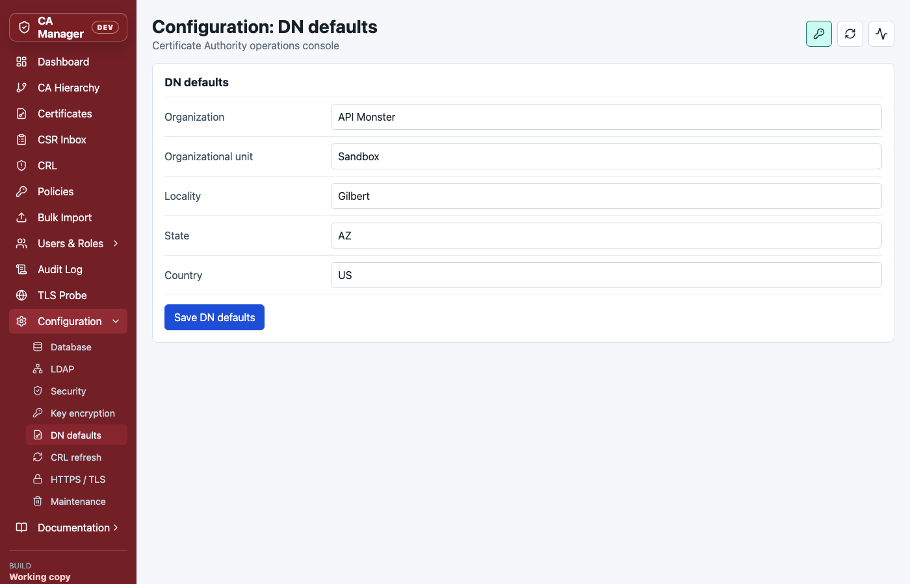

Set default values for the Subject Distinguished Name fields shown in certificate issuance forms. These values pre-fill the form and can be overridden per certificate.

### 9.7 CRL Refresh

Configure the background CRL refresh schedule.

| Field | Description |
|---|---|
| **Interval minutes** | How often the API checks for missing or soon-to-expire CRLs. |
| **Refresh window hours** | Refresh CRLs whose `nextUpdate` is within this many hours. |

Saved changes are picked up by the API scheduler within about one minute.

### 9.8 HTTPS / TLS

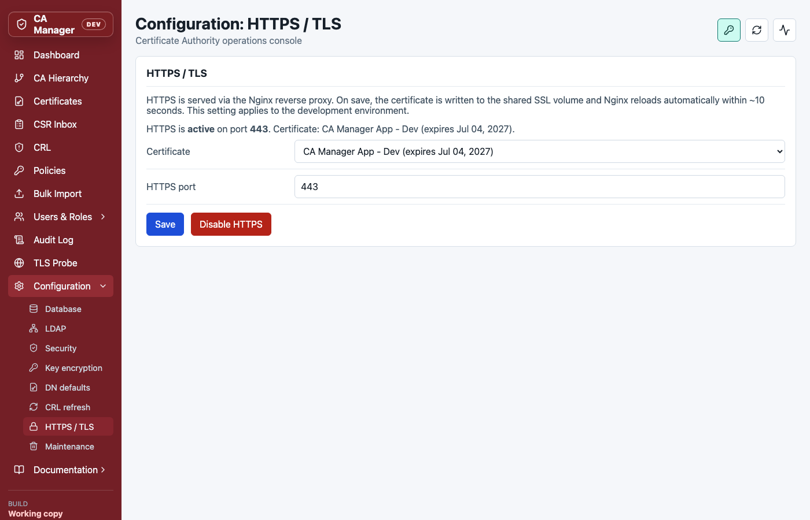

HTTPS is terminated by the **Nginx reverse proxy**. Saving a certificate in this panel writes the cert and key to a shared Docker volume; the Nginx container detects the change and reloads its configuration within **~10 seconds**. No container restart is required.

#### Prerequisites

Before enabling HTTPS you need a leaf certificate already in CA Manager that meets all of the following:

- **Covers the hostname or IP address** users will type in the browser — the hostname should appear as a DNS Subject Alternative Name (SAN), and an IP literal should appear as an IP SAN.
- Is a **leaf certificate**, not a root CA or intermediate CA.
- Has its **private key stored in CA Manager** (either issued by CA Manager or imported with a matching private key).

If you do not have a suitable certificate yet, issue one from the **Certificates** tab before continuing. The built-in **Web Server** template is a good starting point: select your issuing CA, enter the server hostname or IP address as the Common Name, add any extra DNS or IP SANs, and click **Issue Certificate**.

#### Enable HTTPS

1. Navigate to **Configuration → HTTPS / TLS**.
2. In the **Certificate** dropdown, select the leaf certificate to use.
3. Confirm the **HTTPS port** field shows `443` (or the value you have set for `APP_HTTPS_PORT` in your `.env`).
4. Click **Save**.

Within about 10 seconds Nginx reloads and:

- HTTPS is live on port 443.
- All HTTP requests on port 80 are automatically redirected to HTTPS with a `301` redirect.
- The panel status line updates to **HTTPS is active** and shows the port and certificate expiry date.

#### Verify the Configuration

Open a browser and navigate to `https://your-hostname/`. You should reach the CA Manager login screen over HTTPS with a valid (green padlock) connection, provided your browser trusts the issuing CA.

To verify from the command line:

```sh
# Quick connectivity check — skips certificate trust validation
curl -kI https://your-hostname/health/live

# Full trust check using your CA Manager root CA certificate
curl --cacert /path/to/root-ca.pem https://your-hostname/health/live
```

To confirm that HTTP redirects to HTTPS:

```sh
curl -I http://your-hostname/
# Expected response:
#   HTTP/1.1 301 Moved Permanently
#   Location: https://your-hostname/
```

To confirm the reload happened in the Nginx container:

```sh
docker compose logs --tail=30 nginx
```

#### Change the Certificate

To swap to a different certificate — for example, after renewing one that is close to expiry — open **Configuration → HTTPS / TLS**, select the new certificate from the dropdown, and click **Save**. Nginx reloads within ~10 seconds. There is no downtime during the swap.

#### Disable HTTPS

1. Navigate to **Configuration → HTTPS / TLS**.
2. Click **Disable HTTPS**.

Nginx switches back to HTTP-only mode within ~10 seconds. Port 443 stops accepting connections, port 80 serves the app without any redirect, and the panel status updates to **HTTPS is not active**.

#### Fallback and Recovery

If HTTPS stops working or Nginx becomes unreachable after a configuration change, use one of the following recovery paths.

**Option 1 — Disable via the UI (preferred)**

If the API container is still running and you can reach the web UI over HTTP or directly on port 3000, navigate to **Configuration → HTTPS / TLS** and click **Disable HTTPS**. Nginx reloads to HTTP-only within ~10 seconds.

**Option 2 — Clear the SSL volume**

If Nginx is in a crash loop or the web UI is unreachable:

```sh
# Stop the stack
docker compose down

# Remove only the nginx SSL volume
# This volume holds only the active TLS cert and key — no PKI data is stored here
docker volume rm ca-manager_ca-manager-nginx-ssl

# Restart; Nginx comes up in HTTP-only mode
docker compose up -d
```

After the stack is back up, re-enable HTTPS from the UI once you have resolved the certificate issue.

**Option 3 — Rebuild the Nginx image**

If the Nginx container itself needs to be rebuilt (e.g. after updating the proxy configuration):

```sh
docker compose up --build --force-recreate nginx
```

> All PKI data, certificates, private keys, configuration, and audit logs are stored in MySQL, not in the Nginx SSL volume. Clearing or recreating that volume does not affect any CA Manager data.

### 9.9 Maintenance

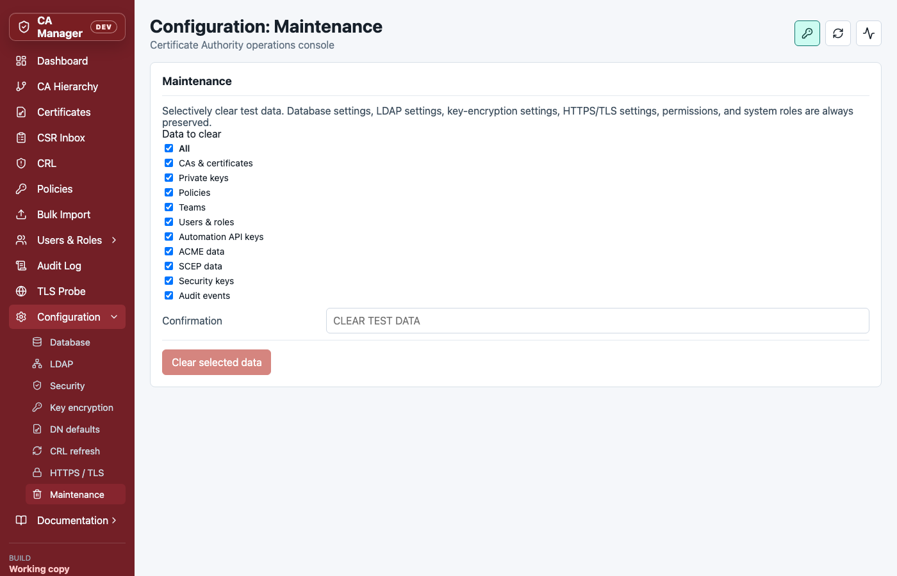

**Clear Test Data** removes selected categories of data from the database.

| Checkbox | What is removed |
|---|---|
| **CAs & certificates** | CA records, certificate records, CSRs, revocations, and export records. Dependent ACME and SCEP enrollment records are also cleared so CAs can be removed cleanly. |
| **Private keys** | Stored private-key inventory records. |
| **Policies** | Signing policies. |
| **Teams** | Teams and team memberships. |
| **Users & roles** | User-role assignments, custom roles, custom role permissions, and user accounts. |
| **Automation API keys** | Service accounts and issued API key tokens. |
| **ACME data** | ACME account policies, external account binding keys, accounts, nonces, orders, authorizations, and challenges. |
| **SCEP data** | SCEP enrollment policies and one-time challenges. |
| **Security keys** | Enrolled WebAuthn/FIDO2 security keys and pending security-key challenges. |
| **Audit events** | Audit log entries. |

Check **All** to select every category, then click **Clear Selected Data** and confirm.

Database settings, LDAP provider settings, LDAP group role mappings, key-encryption settings, HTTPS/TLS settings, permissions, and system roles are preserved.

> **Warning:** This operation is irreversible. Use with caution in production.

---

## 10. Access Control

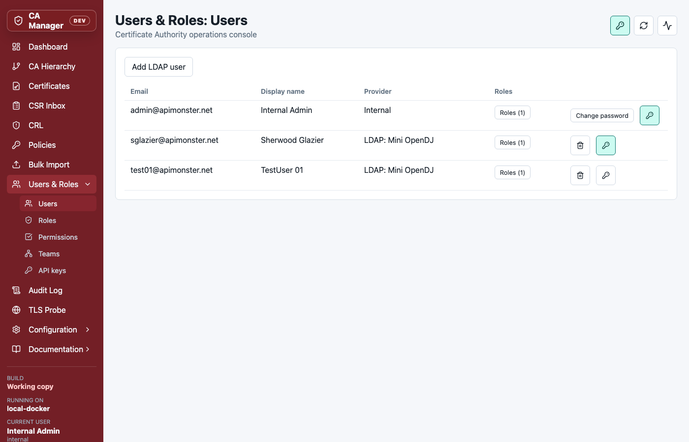

The **Users & Roles** section manages accounts, roles, permissions, and teams.

### 10.1 Users

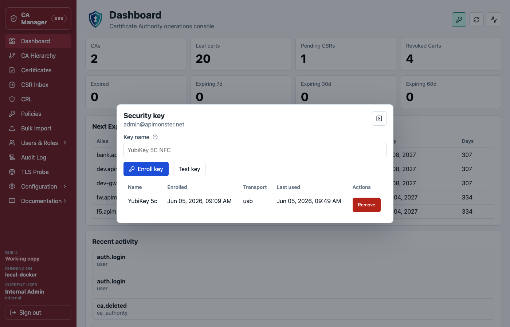

The **Users** sub-tab lists all accounts. LDAP-backed users show their specific provider and a disabled badge if that provider is disabled. Click **Roles (N)** on any user to open a role assignment modal where you can check or uncheck roles. LDAP-backed users also show a trash-icon button; clicking it removes that user from CA Manager and deletes their local role assignments. Internal users may have a **Change password** option when the calling account has `users:manage`.

Click **My security keys** in the header to enroll or test your own WebAuthn/FIDO2 security key. Users must enroll and test their own security keys from their own session. Administrators with user-management access can open the key icon on a user row to review or remove enrolled keys, but cannot enroll a key on behalf of another user.

### 10.2 Roles

Roles are named collections of permissions. CA Manager ships with built-in roles for internal administration, CA administration, leaf certificate operations, audit review, automation administration, ACME administration, private-key custody, and identity administration. Additional custom roles can be created and customized. Only users with the built-in **internal_admin** role can assign or remove **internal_admin** from users or service accounts, or grant permissions they do not already hold.

To create a role:

1. Click **New Role**.
2. Enter a name and optional description.
3. Toggle the permissions the role should grant.
4. Click **Save Role**.

To edit an existing custom role, click its row to expand it, update the name, description, or permissions, then click **Save role**. System roles are read-only — click their row to inspect their permissions, but the fields cannot be edited.

### 10.3 Permissions Reference

| Permission | Description |
|---|---|
| `ca:create` | Create root and intermediate certificate authorities. |
| `ca:read` | View certificate authorities. |
| `ca:update` | Update certificate authority metadata and status. |
| `ca:sign_intermediate` | Use a CA to sign intermediate certificate authorities. |
| `ca:export_private_key` | Export certificate authority private keys. |
| `leaf:create` | Issue and import leaf certificates. |
| `leaf:read` | View certificates. |
| `leaf:revoke` | Revoke and delete certificates. |
| `leaf:export` | Export leaf certificates and certificate chains. |
| `leaf:export_private_key` | Export leaf private keys in PEM, PKCS#12/PFX, or JKS bundles. |
| `policy:read` | View certificate policies. |
| `policy:manage` | Create and update certificate policies. |
| `users:manage` | Create users and manage role assignments. |
| `ldap:manage` | Configure LDAP authentication and group mappings. |
| `config:manage` | Modify configuration settings. |
| `audit:read` | View the audit log. |
| `teams:manage` | Create and manage teams and team membership. |
| `teams:read` | View teams and team membership. |
| `automation:manage` | Manage service accounts and scoped API keys. |
| `acme:manage` | Manage ACME account policies and External Account Binding keys. |

### 10.4 Teams

Teams provide an ownership model for CAs and certificates and can be used as a filter in the certificate list.

To create a team:

1. Click the **Teams** sub-tab.
2. Click **New Team**, enter a name and optional description.
3. Click **Save**.

Assign a certificate or CA to a team by opening its details panel and selecting the team from the **Owner** dropdown.

---

## 11. Automation API Access

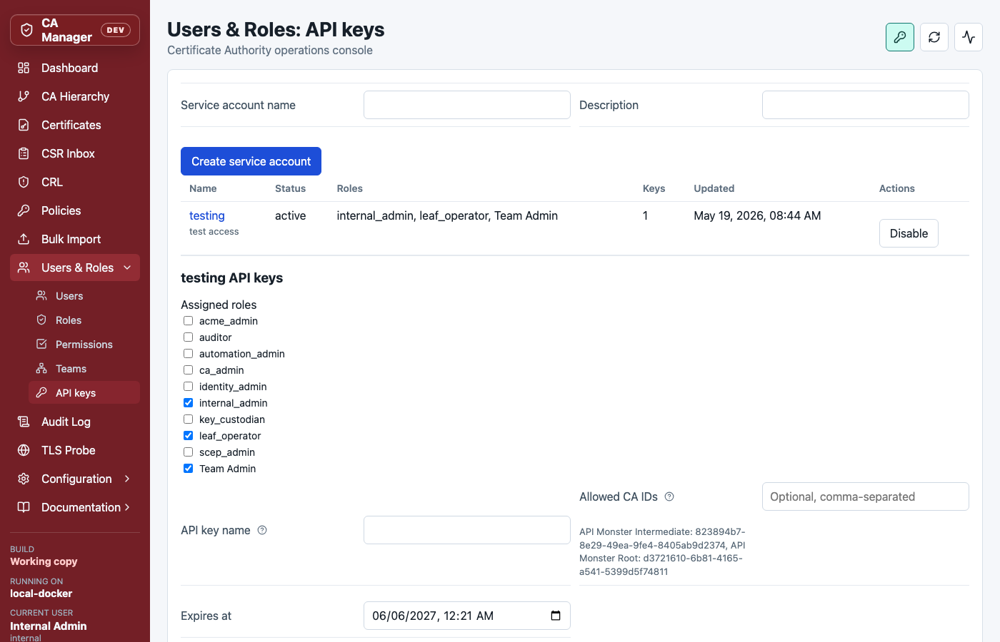

Service accounts are non-human identities for CI/CD jobs, scripts, and other automated certificate workflows. They authenticate to the `/api/v1` API with API keys instead of browser session cookies.

Service account management is available in the web UI under **Users & Roles > API keys** and through the REST API.

### 11.1 Required Permission

Only users with `automation:manage` can create service accounts, assign service-account roles, issue keys, update service-account status, or delete keys. The built-in `internal_admin` and `automation_admin` roles include this permission. Only `internal_admin` can assign or remove the `internal_admin` role on a service account, or assign service-account roles with permissions the caller does not already hold.

### 11.2 Service Account Endpoints

| Endpoint | Purpose |
|---|---|
| `GET /api/v1/service-accounts` | List service accounts. |
| `POST /api/v1/service-accounts` | Create a service account. |
| `PATCH /api/v1/service-accounts/{serviceAccountId}` | Update description, status, or assigned roles. |
| `DELETE /api/v1/service-accounts/{serviceAccountId}` | Delete a disabled service account. |
| `GET /api/v1/service-accounts/{serviceAccountId}/tokens` | List token metadata. |
| `POST /api/v1/service-accounts/{serviceAccountId}/tokens` | Create a scoped API key. |
| `DELETE /api/v1/service-accounts/{serviceAccountId}/tokens/{tokenId}` | Delete a key. |

Key creation returns the raw key value once. CA Manager stores only a SHA-256 key hash, key prefix, status, expiry, scopes, and last-used timestamp.

### 11.3 Roles And Scopes

Service accounts use the same roles as users. Assign roles to the service account in **Users & Roles > API keys**; API keys issued for that account inherit the permissions granted by those roles.

A key scope may also contain `caIds`, an optional list of issuing CA IDs allowed for certificate issuance, certificate import, intermediate creation, and CSR signing.

If `caIds` is omitted, the key is not restricted to specific CAs. If it is present, issuance and signing requests must use one of the listed CA IDs.

### 11.4 Using a Token

Send the key with the CA Manager API key header:

```bash
curl -H "X-CA-Manager-API-Key: cam_sk_abc12345..." \
  http://localhost/api/v1/certificates
```

`Authorization: ApiKey <key>` and legacy `Authorization: Bearer <token>` are also accepted for scripted clients.

Expired keys, disabled service accounts, and deleted keys cannot authenticate.

---

### 11.5 Expiry Notifications

Expiry notification settings are available through the automation API. They define threshold days and outbound channel configuration for email, Slack webhook, and generic HTTP webhook delivery.

| Endpoint | Purpose |
|---|---|
| `GET /api/v1/automation/expiry-notifications` | Read the current expiry notification settings. |
| `PUT /api/v1/automation/expiry-notifications` | Save threshold and channel settings. |
| `GET /api/v1/automation/expiry-notifications/due` | Preview certificates matching configured expiry thresholds. |

Common thresholds are 90, 30, 14, and 7 days before expiry.

---

## 12. ACME Enrollment

CA Manager exposes an internal, policy-bound ACME endpoint for automated certificate enrollment.

### 12.1 Directory URL

Use the ACME directory URL exposed by the deployment:

```text
http://localhost/acme/directory
```

Some clients require HTTPS for the ACME directory. For those clients, enable HTTPS through **Configuration → HTTPS / TLS** and use:

```text
https://your-hostname/acme/directory
```

### 12.2 Enrollment Model

CA Manager ACME is designed for internal PKI automation:

- Accounts register with ACME account keys.
- External Account Binding can be required by policy.
- DNS identifiers are allowed when they match policy suffixes.
- Wildcard identifiers are supported when the base suffix is allowed.
- Finalization signs the submitted CSR through the existing CA Manager signing workflow.
- ACME revocation and account key rollover are supported.

HTTP-01, DNS-01, and TLS-ALPN-01 challenge handling is treated as internal policy validation, not public domain-control validation.

### 12.3 Client Examples

Client setup examples are documented in:

- `docs/ACME_CLIENTS.md`
- `docs/ACME_COMPATIBILITY.md`

Compatibility has been verified with certbot, lego, and acme.sh against the local ACME directory.

---

## 13. SCEP Enrollment

SCEP gives network devices and MDM-enrolled clients a protocol endpoint for policy-bound certificate enrollment.

| Endpoint | Purpose |
|---|---|
| `GET /scep/{policyId}?operation=GetCACaps` | Read SCEP capabilities. |
| `GET /scep/{policyId}?operation=GetCACert` | Download the issuing CA certificate for the SCEP policy. |
| `POST /scep/{policyId}?operation=PKIOperation` | Submit a CMS SCEP `PKCSReq` message and receive a CertRep response. |

Create and maintain policies through the authenticated management API:

| Endpoint | Purpose |
|---|---|
| `GET /api/v1/scep/enrollment-policies` | List SCEP enrollment policies. |
| `POST /api/v1/scep/enrollment-policies` | Create a policy with an issuing CA, allowed DNS suffixes, and validity cap. |
| `PATCH /api/v1/scep/enrollment-policies/{policyId}` | Update or disable a policy. |
| `GET /api/v1/scep/enrollment-policies/{policyId}/challenges` | List challenge metadata. |
| `POST /api/v1/scep/enrollment-policies/{policyId}/challenges` | Create a one-time challengePassword. |

The create-challenge response is the only response that includes the challengePassword. Give that value to the device enrollment workflow that builds the CSR. CA Manager accepts `PKCSReq` messages only, requires the CSR challengePassword to match an unused unexpired policy challenge, requires DNS SANs to match the policy suffixes, and then signs through the existing CSR workflow.

---

## 14. Audit Log

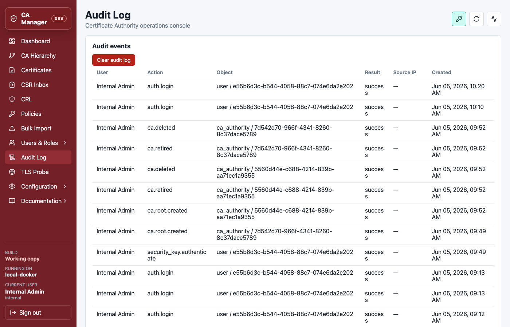

The **Audit Log** tab shows a chronological record of all significant actions.

| Column | Description |
|---|---|
| **When** | Timestamp of the event. |
| **User** | Account that performed the action, or "system" for automated operations. |
| **Action** | Event type (e.g., `certificate.issued`, `auth.login`, `ca.created`). |
| **Object** | Type and ID of the affected resource. |
| **Source IP** | Client IP address, if available. |
| **Result** | `success` or `failure`. |

The audit log is append-only and cannot be edited.

### 14.1 Exporting Audit Events

Audit events can be exported through the API for SIEM integration or compliance review.

| Endpoint | Purpose |
|---|---|
| `GET /api/v1/audit-events/export?format=json` | Export audit events as JSON. |
| `GET /api/v1/audit-events/export?format=csv` | Export audit events as CSV. |

Optional `startDate` and `endDate` query parameters limit the export range.

---

## 15. TLS Probe

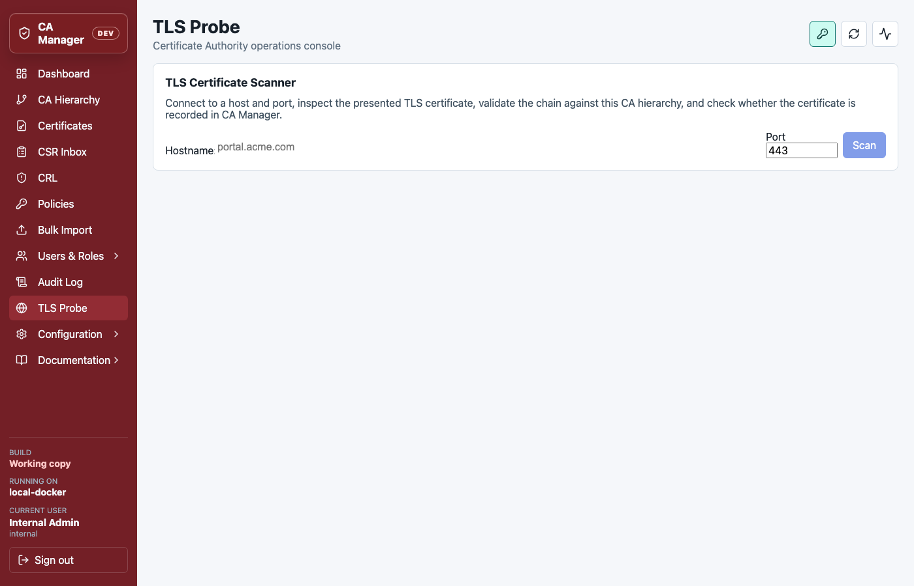

The **TLS Probe** tab connects to a live hostname and port, retrieves the presented TLS certificate chain, and reports the findings against the CA hierarchy and certificate records stored in CA Manager.

### 15.1 Running a Scan

1. Open **TLS Probe** in the left navigation.
2. Enter the **Hostname** (e.g., `api.example.com`) and **Port** (default 443).
3. Click **Scan**.

CA Manager opens a TLS connection to the target, captures the presented certificate and any intermediate certificates in the chain, and returns results immediately.

> The connection uses `rejectUnauthorized: false` so it succeeds even when the presented certificate is self-signed or issued by this CA hierarchy. The chain validation step below determines whether it is trusted.

If a server fails the initial handshake because it offers weak finite-field Diffie-Hellman parameters, CA Manager retries that probe at OpenSSL security level 0 so the certificate can still be inspected. The scan result includes a warning when this fallback is used; the server should be updated to use stronger DH parameters.

### 15.2 Scan Results

Results appear as a set of status chips followed by certificate details.

Warnings may appear when the scan needed compatibility fallback behavior, such as retrying against a server with weak Diffie-Hellman parameters.

#### Chain Validation

| Status | Meaning |
|---|---|
| **Chain valid** | The presented certificate chain traces back to one of the active CAs in CA Manager. The matched CA name is shown. |
| **Chain invalid** | The chain could not be validated against any CA in CA Manager. The OpenSSL error is shown. |

A chain can be invalid for several reasons: an unknown root CA, an expired intermediate, a missing intermediate in the chain, or a certificate issued outside this PKI.

#### Expiry Status

| Status | Meaning |
|---|---|
| Green — *N days until expiry* | The certificate is not expired and not expiring soon. |
| Yellow — *N days until expiry* | The certificate expires within 30 days. |
| Red — *Expired N days ago* | The certificate has already expired. |

#### Certificate Match

| Status | Meaning |
|---|---|
| **Matches recorded certificate** | The leaf certificate fingerprint matches a certificate tracked in CA Manager. The recorded common name and status (active, revoked, etc.) are shown. |
| **Not found in CA Manager** | The fingerprint does not match any stored certificate. The certificate may have been issued outside CA Manager or not yet imported. |

### 15.3 Certificate Details

Below the status chips, the full leaf certificate details are shown:

| Field | Description |
|---|---|
| **Subject** | Full RFC 2253 subject distinguished name. |
| **Issuer** | Full RFC 2253 issuer distinguished name. |
| **Serial** | Certificate serial number in hex. |
| **Fingerprint (SHA-256)** | SHA-256 fingerprint of the leaf certificate, normalized to lower-case hex. |
| **Valid from / until** | Certificate validity window. |
| **DNS SANs** | Subject Alternative Names of type DNS. |
| **IP SANs** | Subject Alternative Names of type IP address. |
| **Scanned at** | UTC timestamp of the scan. |

If the server presented intermediate certificates, they are listed in a **Presented chain** table showing each certificate's subject, issuer, expiry, and whether it is a CA or self-signed.

Click **Show PEM** to expand the raw PEM text of the leaf certificate.

### 15.4 Required Permission

The TLS probe endpoint is protected by `ca:read`. Any role that can view certificate authorities can also run a TLS scan.

---

## 16. In-App Documentation

The **Docs** tab in the left navigation renders the CA Manager documentation directly in the browser. All diagrams (Mermaid flowcharts and ER diagrams) are rendered inline.

Available documents:

| Document | Contents |
|---|---|
| **README** | Project overview, architecture, data model, API reference, and configuration. |
| **User Manual** | This document — operational guide for all UI features. |
| **Release Notes** | Production and beta release history. |
| **Use Cases** | Customer journey descriptions and scenario walkthroughs. |
| **ACME Clients** | Client setup examples for ACME integrations. |
| **ACME Compatibility** | ACME compatibility test notes. |

---

## 17. Deployment Process

CA Manager uses Docker Compose for local development, beta, and production. The fleet deployment script for beta/prod deploys Git refs from GitLab to remote Docker hosts over SSH; dev deploys local files even if not committed to Git.

### 17.1 Local Development

Use the local rebuild script when you want to rebuild containers from the current working tree without pulling from Git:

```bash
npm run deploy:dev
```

`npm run deploy:dev` is the normal local development deploy command. It wraps `npm run docker:recreate`, which rebuilds and recreates local containers from the current working tree. By default, development containers use the shared dev database settings from `DEV_RUNTIME_MYSQL_*` in `.env`. On `studio.apimonster.net`, the rebuild script defaults those values to the shared dev database on `esx-sb-mysql8`. On `Midnight-Air.local`, it defaults the Dockerized API to the MySQL instance running directly on the laptop by using `host.docker.internal` from inside the container.

Use an isolated local MySQL container only when you explicitly want a separate database:

```bash
npm run docker:recreate:local-db
```

### 17.2 Beta Deployment

Beta deployments go to the beta host and use the beta database. The deployment workstation must have `BETA_MYSQL_PASSWORD` set in `.env`; `BETA_MYSQL_DATABASE` and `BETA_MYSQL_USER` default to `beta_manager`.

Deploy the latest pushed beta tag:

```bash
npm run deploy:beta
```

The script selects the latest version-sorted beta tag, such as `1.1.1b3`, checks it out on the beta host, generates a remote `.env` with `CA_MANAGER_ENVIRONMENT=beta`, maps `BETA_MYSQL_*` into the runtime `MYSQL_*` variables, rebuilds the production Compose stack, recreates containers, and runs health checks.

Deploy or roll back to a specific beta tag:

```bash
npm run deploy:beta -- --ref 1.1.1b2
```

Keep `--beta` when rolling back beta so the beta host and beta database configuration remain active.

The requested tag must already be pushed to GitLab. If the tag exists only locally, remote hosts will fail during checkout because they fetch from GitLab.

### 17.3 Production Deployment

Production deployments go to the hosts listed in `deploy/servers.txt` unless `--host` is supplied. Production uses `MYSQL_*` from `.env`.

Deploy the latest pushed production release tag:

```bash
npm run deploy:prod
```

Production release tags are tags like `1.1.1` or `v1.1.1`. Beta tags such as `1.1.1b3` are ignored by production default selection.

Deploy a specific production release:

```bash
npm run deploy:prod -- --ref 1.1.1
```

The requested tag must already be pushed to GitLab. If the tag exists only locally, remote hosts will fail during checkout because they fetch from GitLab.

### 17.4 Remote Deployment Steps

For each target host, `scripts/deploy-fleet.sh`:

1. Resolves the remote checkout path, defaulting to `~/ca_manager`.
2. Verifies `git`, `docker`, and `docker compose` are available.
3. Clones the repository if needed, or reuses the existing checkout.
4. Fetches branches and tags from GitLab.
5. Checks out the requested branch, tag, or commit.
6. Resets and cleans the remote checkout.
7. Copies a generated `.env` to the remote checkout.
8. Adds `CA_MANAGER_NODE_NAME` from the remote host name.
9. Runs `scripts/rebuild-recreate-check-prod.sh` unless `--skip-health-check` is used.

The remote checkout is intentionally reset with `git reset --hard` and cleaned with `git clean -fd`. Do not keep manual changes in the remote checkout.

### 17.5 Common Options

| Option | Use |
|---|---|
| `--beta` | Deploy the latest beta tag to the beta host using the beta database. |
| `--ref REF` | Deploy a specific branch, tag, or fetched commit. |
| `--host HOST` | Deploy to one host instead of the server inventory. Can be passed multiple times. |
| `--user USER` | Override the SSH user for hosts that do not include `user@host`. |
| `--servers FILE` | Use a different production server inventory file. |
| `--local-db` | Pass `--local-db` to the remote production rebuild script. |
| `--skip-health-check` | Build and recreate containers without running the full remote health-check script. |

### 17.6 Pre-Deployment Checklist

- Commit the intended changes.
- Tag the intended release.
- Push the branch and tag to GitLab.
- Confirm `.env` has the required secrets for the target environment.
- For beta, confirm `BETA_MYSQL_PASSWORD` is present.
- For production, confirm `deploy/servers.txt` contains the intended hosts.

---

## Appendix A — Environment Variables

| Variable | Default | Description |
|---|---|---|
| `API_HOST` | `0.0.0.0` | Bind address for the API server. |
| `API_PORT` | `3000` | Port the API listens on. |
| `APP_HTTP_PORT` | `80` | Host port published for the Nginx HTTP entrypoint. |
| `APP_HTTPS_PORT` | `443` | Host port published for the Nginx HTTPS entrypoint. Only accepts connections after HTTPS is configured via the UI. |
| `VITE_ALLOWED_HOSTS` | `localhost,127.0.0.1,mini.apimonster.net,camanager.apimonster.net,ca.apimonster.net` | Browser hostnames allowed by the Vite dev server behind nginx. |
| `SESSION_SECRET` | *(required)* | Secret used to sign session cookies. Use a long random string in production. |
| `KEY_ENCRYPTION_SECRET` | *(required)* | 32+ character secret used to encrypt private keys at rest. |
| `CRL_REFRESH_INTERVAL_MINUTES` | `60` | Bootstrap default for the background CRL refresh interval. Internal admins can override it in Configuration. |
| `CRL_REFRESH_WINDOW_HOURS` | `24` | Bootstrap default for the CRL refresh window. Internal admins can override it in Configuration. |
| `MYSQL_HOST` | `localhost` | MySQL server hostname. |
| `MYSQL_PORT` | `3306` | MySQL server port. |
| `MYSQL_DATABASE` | `ca_manager` | Database name. |
| `MYSQL_USER` | `ca_manager` | Database user. |
| `MYSQL_PASSWORD` | *(required)* | Database user password. |
| `BETA_MYSQL_DATABASE` | `beta_manager` | Beta database name used by beta deploys and `syncdb:dev`. |
| `BETA_MYSQL_USER` | `beta_manager` | Beta database user used by beta deploys and `syncdb:dev`. |
| `BETA_MYSQL_PASSWORD` | *(required for beta)* | Beta database password used by beta deploys and `syncdb:dev`. |
| `DEV_MYSQL_HOST` | `esx-sb-mysql8.apimonster.net` | Shared dev database host used as the `syncdb:dev` target and `syncdb` source. |
| `DEV_MYSQL_PORT` | `3306` | Shared dev database port. |
| `DEV_MYSQL_DATABASE` | `dev_manager` | Shared dev database name. |
| `DEV_MYSQL_USER` | `dev_manager` | Shared dev database user. |
| `DEV_MYSQL_PASSWORD` | *(required for dev sync)* | Shared dev database password. |
| `DEV_RUNTIME_MYSQL_HOST` | `esx-sb-mysql8.apimonster.net` | MySQL host used by ordinary development Docker runs. The rebuild script defaults this to `host.docker.internal` on `Midnight-Air.local` so the API container connects to laptop-hosted MySQL. |
| `DEV_RUNTIME_MYSQL_PORT` | `3306` | MySQL port used by ordinary development Docker runs. |
| `DEV_RUNTIME_MYSQL_DATABASE` | `dev_manager` | Database name used by ordinary development Docker runs. |
| `DEV_RUNTIME_MYSQL_USER` | `dev_manager` | Database user used by ordinary development Docker runs. |
| `DEV_RUNTIME_MYSQL_PASSWORD` | *(required for development Docker)* | Database password used by ordinary development Docker runs. |
| `LOCAL_MYSQL_HOST` | `127.0.0.1` | Local laptop MySQL host used as the `syncdb` target. |
| `LOCAL_MYSQL_PORT` | `3306` | Local laptop MySQL port. |
| `LOCAL_MYSQL_DATABASE` | `dev_manager` | Local laptop development database name. |
| `LOCAL_MYSQL_USER` | `dev_manager` | Local laptop development database user. |
| `LOCAL_MYSQL_PASSWORD` | *(may be empty)* | Local laptop development database password. |
| `SERVE_WEB_DIR` | *(unset)* | When set, the API serves static web files from this path (used in the standalone image). |

---

## Appendix B — Running with Docker

### Development (external MySQL)

```bash
docker compose up
```

The app entrypoint is `http://localhost`. nginx serves the web UI at `/` and proxies API traffic under `/api`, `/health/live`, `/health/ready`, `/acme`, `/crl`, and `/ocsp` to the API container.

Direct development ports remain available at `http://localhost:5173` for the web UI and `http://localhost:3000` for the API.

### Standalone Image (all-in-one)

The standalone image bundles MySQL, the API, and the web UI in a single container.

**Build:**

```bash
docker build -f Dockerfile.standalone -t ca-manager:latest .
```

**Run:**

```bash
docker run -d \
  --name ca-manager \
  -p 3000:3000 \
  -v ca-manager-data:/var/lib/mysql \
  -e SESSION_SECRET="$(openssl rand -hex 32)" \
  -e KEY_ENCRYPTION_SECRET="$(openssl rand -hex 32)" \
  ca-manager:latest
```

Open `http://localhost:3000` in your browser. On first start the database is initialized automatically and you are prompted to create the admin account.

> **Important:** Always set `SESSION_SECRET` and `KEY_ENCRYPTION_SECRET` to strong random values. If `KEY_ENCRYPTION_SECRET` is changed after keys have been stored, those keys can no longer be decrypted.

### Pushing to Docker Hub

```bash
docker tag ca-manager:latest yourusername/ca-manager:latest
docker push yourusername/ca-manager:latest
```

Users can then run it with:

```bash
docker run -d \
  --name ca-manager \
  -p 3000:3000 \
  -v ca-manager-data:/var/lib/mysql \
  -e SESSION_SECRET="$(openssl rand -hex 32)" \
  -e KEY_ENCRYPTION_SECRET="$(openssl rand -hex 32)" \
  yourusername/ca-manager:latest
```
